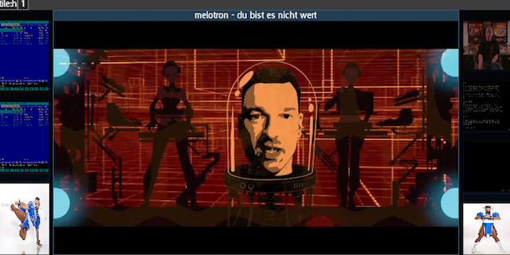

# Auto-layouter

The auto-layouter is an example of a built-in [tool](Tools). It extends the
behavior of the workspace tiling mode with automatic management of window
sizing and positioning to fit a certain profile. The currently provided one
comes in two variants, center-focus and center-focus (force scale).

You can activate this mode by going to
<i>global/tools/auto layouting/center-focus</i> and revert back from it with
<i>global/tools/auto layouting/default</i>. This mode works with three or
more windows and split the screen into three columns: a center area (the
intended focus) and two side columns. New windows will spawn de-selected evenly
divided in the side columns, as shown in this screenshot:

This mode was specifically made for working with many terminal windows, VMs,
remote desktop sessions etc. where you need to keep a watchful eye on some
windows, but don't want to draw unnecessary attention away from whatever you
are working on.

The scaled version always tells the clients that they have the size of the
center area even when they are in the smaller side columns. This cuts down
on resize- negotiation, resize- related refreshes and eliminates any
resize-latency when swapping with center.

There are three configurable options reachable through
<i>global/config/tools/auto layouting</i>:

1. Side-Opacity (scaled) applies in center-focus scaled mode and forces a
   background blend with a certain opacity in the 0 (invisible) to 1(opaque).

2. Mouse-SelectSwap (yes or no), if set to yes, clicking a window in the
   side columns automatically swaps it with the center area.

3. Center Weight (0.5 to 0.9) determins how much of the screen width that
   should be reserved for the center area.

It also adds two new paths to <i>target/window/swap</i>, Swap-Focus and
Swap-Select(Focus). If activated with the center window selected, the
center window will be swapped with the previous that was last in the center
window.

# Future Changes
- Additional auto-layouting modes (spiral etc.)

