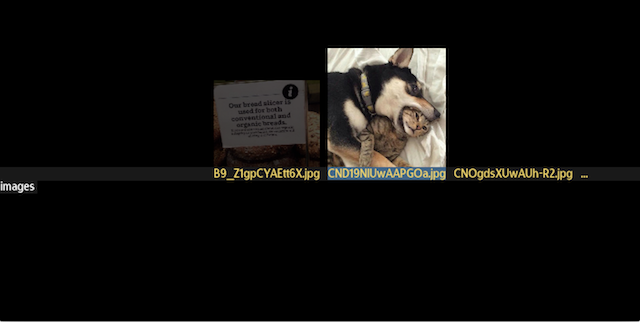

# Media/File Browser
Multiple features require some way of selecting files to be used as input.
There is a limited browser that covers the 'shared resources' namespace.
It can be accessed via the <i>global/open/browse</i> path.

It is still quite primitive, and only offers limited preview of image
resources, and therefore currently only accept a preset list of hardcoded
extensions that are defined in the <i>durden/menus/global/open.lua</i> file.

You navigate by typing or using the left/right/up/down bindings to move
the selected item, and use the select (enter) binding to activate.

Holding meta1 while activating a resource will spawn the resource in the
background while keeping the menu active.

# Preview Controls

Via get <i>global/settings/browser</i> a number of preview controls are
exposed. The ones currently available are:

- Preview (image, all or none) changes the types that will be previewed
- Timer controls how much time that should be elapsed before the preview is activated
- Position controls video preview starting position
- Trigger (selection, visibility) controls if preview should be triggered by selection or as soon as a label is visible

# Special Paths

Holding meta1 while pressing ESCAPE will have you go up one level in the
tree, but typing ".." also works.

The root can be reached by entering "/", and the current directory can
be refreshed by typing ".".

You can either use lua patterns as a filter by prefixing with "%%", or
use asterisks as normal wildcard matching.

By typing a single '%', you get access to options that can change the
sorting order.

# Future Changes
- Asynchronous globbing (engine issue)
- Allow adding files to a stack than can be atomically
  packed/deleted/forwarded/transformed/queued for 'playlist'
- Toggle file details on/off
- Map client bchunk- hint events to spawn browser for universal
  open/save file-picking
- Selectable namespace (global or appl-)
- Extend menu bindings to cover browser paths
