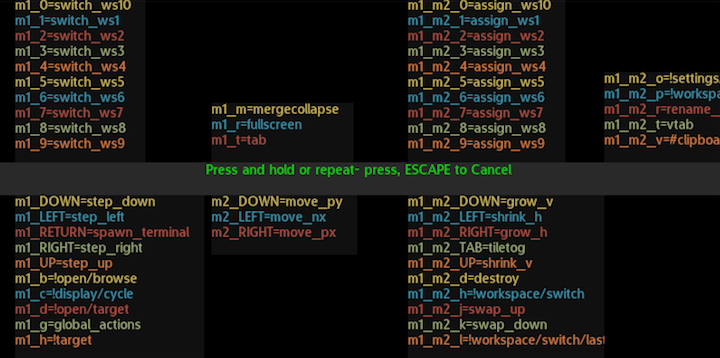

'The Menu' is a key feature in Durden, where all the internal features are
exposed and controlled. Underneath the surface, the menu covers two directory
trees (one 'global' and one 'target') where each entry describes either
a subdirectory, an action or a key/value input. The global tree convers system
wide settings, and the target tree covers the currently selected window.

This annotated screenshot shows the default navigation UI in the root
of the global directory tree:

This UI gets activated when you press your global or target menu keybinding
(or mouse-left-click the statusbar layout button when in float mode).

The [widget area](#widgets) shows path- activated widgets, the current entries
shows the filtered directory listing at your current path, the path indicator
shows your current path and the filter input field shows your currently active
filter.

Paths in these trees can be bound to keys, timers, external IPC or simply
browsed via the user interface. The actual set of directories and entries that
are available will shift dynamically, as each entry has a dynamic 'evaluate'
function that determines if the feature it represents is available right now or
not.

Underneath the surface, these paths are evaluated like this:

    !open/target
    #clipboard/paste
    !settings/visual/mouse_scale=5

With \! being used to pick the global directory, and the \# for the target
directory. The =5 in the example above is a binding to setting a specific
key/value pair (here, setting the mouse cursor scale factor to 5).

Due to key naming restrictions, paths currently bound to custom keys will
have a slightly diffferent format in the database. Inspecting them will look
something like this:

    arcan_db show_appl durden |grep cust
       custg_m1_m2_p=workspace/switch
       custs_m1_h=clipboard/paste

## Navigation

The easiest way to navigate the menu, by far, is simply by typing. You should
see the set of available options shrinking as the matched set gets reduced.

The key bound to SELECT (typically ENTER) is used to activate the entry.  If
the entry is colored grey, it is an action or a value- entry dialog. If it is
colored yellow, it is a subdirectory.

As you navigate deeper into the tree, you can use META1+ESCAPE to go up one
level, or simply type '..' and SELECT.

A value entry dialog looks like this:

The contents will vary somewhat with the setup of the menu entries, but will
typically cover a short description, a hint on the valid range, the current
value and an input field colored based on if the current values validate or
not (red like in the screenshot).

## Binding Keys

Though this falls under normal input management, there is a special feature
worth noting in this context. When making a new binding by going to Input/
Bind/Custom, you will be prompted to pick the menu path to bind.

If you select an action, there's nothing complicated going on - that
particular action will be bound. If you select a key/value target, you can
chose between binding the dialog itself or the specific value you enter by
holding META1 when pressing SELECT to activate the dialog. In a similar way,
you can bind activating a subdirectory by holding META1 pressed when pressing
SELECT.

## Widgets 

The widget areas are dynamically populated based on the currently active path.
Widgets in durden come in two forms, one is from lua scripts that are scanned
during startup (see the .lua files in the widgets subpath) that explicitly
binds their activation to certain paths and patterns.

These are used to provide extra information, like the ASCII- table shown when
going for "Input/Keyboard/Map/Bind-UTF8" and the list of keybindings shown when
going for "Input/Bind/Custom" like in the screenshot below:

The included cheatsheet widget, for instance, shows helper information based
on the identity or the tag of the currently select window. You can add your own
by dropping a txt file in the widgets/cheatsheets path. The first line of the
file is a lua pattern that will match against the identity of the window, and
new groups are indiciated with an empty line.

There is also the experimental option to run external widgets. When a client
connects to arcan, it registers a type for its primary segment, and durden
gives special treatment based on advertised type. A 'Game' segment, for
instance, would get access to different input routing paths.

There is a 'Widget' type where subsegments, clipboards and other features are
disabled. These gets forced to a maximum size, and are routed to the global
menu. To write such a client is a little bit of work, though Arcan has a
support layer (also Lua scriptable) as part of the 'TUI' (text-UI) subsystem.
Refer to the Arcan wiki for more on this feature.

## Advanced

Since many advanced menu features rely on figuring out a particular path,
it would be convenient to be able to quickly enumerate the list of possible
options, particularly since the logical path used for a binding will likely
differ from the visual labels you see due to internationalization.

If you use the following special command:

     arcan durden dump_menus

Durden will write the accessible global menu tree to stdout, and the target
tree for a 'standard/null' window (so window type specific entries will not
be shown). You can then use that dump to better define your bindings.
An example of such a dump can be found [here](menus.txt).

However, this dump will not be very accurate, as the menus are dynamically
generated and regenerated based on what the available hardware and the
selected window can do _currently_.

For some menu paths, your only options are to read the source code (the
menu entries are not particularly hard to read as they are mostly small
tables with well known fields), and to increasing the debuglevel further
(-g -g).

Some menu entries are also marked as 'invisible'. This means that they
are only shown when you are interactively binding a menu path to a key.
The reason for this may be that they serve no purpose when a UI is inactive,
or accidentaly activating them would yield in some dangerous state
transition - like toggling displays on/off.

## Coming Features
The following changes are planned for the menu in the near future:

 - Ability to switch between prefix- matching and pattern- matching
 - Mouse and touchpad gesture navigation
 - Mouse Cursor warping to reduce movement
 - Tooltips for each entry
 - Better Widget- area layouting
 - External Widget ICON subsegment added to statusbar, POPUP tried to
   ICON
 - "Popup"- style for floating layout mode
 - FUSE- based mountable interface for filesystem- access
