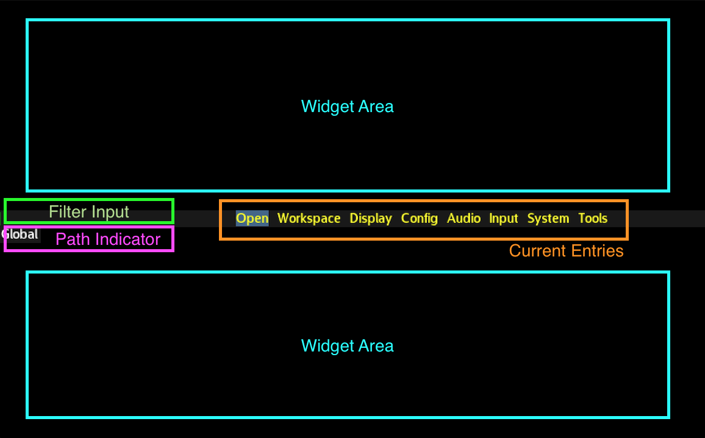

'The Menu' is a key feature in Durden, where all the internal features are
exposed and controlled. Underneath the surface, the menu covers two primary
trees (one 'global' and one 'target') where each entry describes either
a subdirectory, an action or a key/value input. The global tree convers system
wide settings, and the target tree covers the currently selected window.

This annotated screenshot shows the default navigation UI in the root
of the global directory tree:

This UI gets activated when you press your global or target menu keybinding
(or mouse-left-click the statusbar layout button when in float mode).

The [widget area](#widgets) shows path- activated widgets, the current entries
shows the filtered directory listing at your current path, the path indicator
shows your current path and the filter input field shows your currently active
filter.

Paths in these trees can be bound to keys, timers, external IPC or simply
browsed via the user interface. The actual set of directories and entries that
are available will shift dynamically, as each entry has a dynamic 'evaluate'
function that determines if the feature it represents is available right now or
not.

Underneath the surface, these paths are evaluated like this:

    /global/open/target
    /target/clipboard/paste
    /global/settings/visual/mouse_scale=5

The =5 in the example above is a binding to setting a specific key/value pair
(here, setting the mouse cursor scale factor to 5).

Due to key naming restrictions, paths currently bound to custom keys will
have a slightly diffferent format in the database. Inspecting them will look
something like this:

    arcan_db show_appl durden |grep custom
       custom_m1_m2_p=/global/workspace/switch
       custom_m1_h=/target/clipboard/paste

## Navigation

The easiest way to navigate the menu, by far, is simply by typing. You should
see the set of available options shrinking as the matched set gets reduced.

The key bound to SELECT (typically ENTER) is used to activate the entry.  If
the entry is colored grey, it is an action or a value- entry dialog. If it is
colored yellow, it is a subdirectory.

As you navigate deeper into the tree, you can use META1+ESCAPE to go up one
level, or simply type '..' and SELECT.

A value entry dialog looks like this:

The contents will vary somewhat with the setup of the menu entries, but will
typically cover a short description, a hint on the valid range, the current
value and an input field colored based on if the current values validate or
not (red like in the screenshot).

## Binding Keys

Though this falls under normal input management, there is a special feature
worth noting in this context. When making a new binding by going to
/global/input/bind/custom, you will be prompted to pick the menu path to bind.

If you select an action, there's nothing complicated going on - that particular
action will be bound. If you select a key/value target, the default is that the
value you entered will be the actually bound value but if you hold META1 when
selecting the entry, the actual dialog prompt will be bound instead.

In a similar fashion, you can also bind the navigation directory itself
by holding META1 when pressing SELECT.

## Widgets 

The widget areas are dynamically populated based on the currently active path.
Widgets in durden come in two forms, one is from lua scripts that are scanned
during startup (see the .lua files in the widgets subpath) that explicitly
binds their activation to certain paths and patterns.

These are used to provide extra information, like the ASCII- table shown when
going for "global/input/keyboard/map/bind_utf8" and the list of keybindings
shown when going for "global/input/bind/custom" like in the screenshot below:

The included cheatsheet widget, for instance, shows helper information based
on the identity or the tag of the currently select window. You can add your own
by dropping a txt file in the widgets/cheatsheets path. The first line of the
file is a lua pattern that will match against the identity of the window, and
new groups are indiciated with an empty line.

## Multicast

There is also a way to emit the same /target path to a group of windows by
using any of the available subpaths to /windows, where you can affect all
windows, windows of a specific type and so on.

## Advanced

It is also possible to mount the menu tree as a real filesystem, though with
some performance drawbacks at the moment. See the separate 'arcan-cfgfs' tool
that comes with your distribution or as part of the <i>src/tools/acfgfs</i>
path in the arcan source repository, along with the section on [ipc](ipc).

## Coming Features
The following changes are planned for the menu:

 - Mouse Cursor warping to reduce movement
 - Better Widget- area layouting
 - Client- provided menus merged into target- group
 - Alternative representations: radial menu, popup, ...
