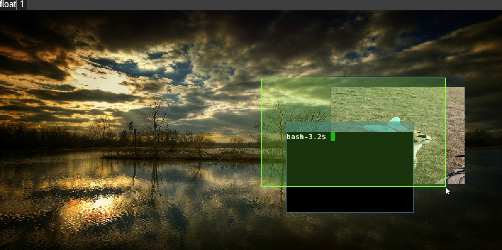

# Recording and Sharing

Recording and sharing are implemented through the
<i>global/display/region</i>, the <i>global/display/displays/.../record</i>
and the <i>target/video/record</i> paths.

The actual recording parameters (<i>framerate, quality, bitrate and
 audio presilience</i>) are set globally via the <i>global/config/recording</i>
path).

The options in the <i>global/display/region</i> path work on a user-selected
region that may cover multiple windows, while as the display specific part
covers the recording of the contents of one particular display, and the target
specific path covers dthe recording of the contents of one particular window.

the options found in the region path are:

- Snapshot (one still frame as a new window)
- Monitor (a window that keeps track of a region)
- [OCR](#ocr)
- Record
- Share
- Forward

When such a path is activated, the cursor turns into a selection region
that looks something like this:

Press the meta1 bound key to reposition the origo of the selection region, or
press the meta2 bound key to align it to the size of the currently selected
window canvas.

The recording/sharing options is best used in floating window management mode
as the region is window-agnostic, only the screen area itself is accounted for.

To activate recording, you either specify a selected window and go through
the <i>target/video/record, target/video/record (no sound)</i> path

A prerequisite for this to work is that arcan has been built with encode
frameserver support, which is auto-detected and enabled if the ffmpeg- set of
dependencies were found.

# OCR <a name="ocr"/>
OCR is a more advanced form of the snapshot, where the contents are sent to
the encode frameserver, which processes one frame and is then killed off. If
the encode frameserver was built with support for the tesseract OCR engine,
it will attempt to OCR convert the contents to text, and any results will
be placed on the clipboard.

# Forward <a name="forward"/>
Forward takes a target window and forwards an output stream of the selected
region into the process that window represents. This is for directed sharing
to clients which supports this feature.

# Future Changes
- Interactive sharing
- Sharing Settings Controls
- Expose RTMP streaming support
- Aggregate Area
- Language Controls
- Audio Mixing Controls
- Account for Window-specific shaders
- Map sharing as a separate display and use multi-display support/management
- Text-to-Speak/Screen-Reader support
