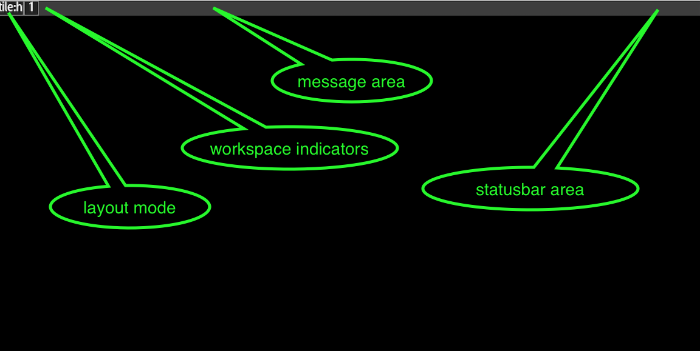

# Downloading/Building
Technically speaking, durden is a set of Lua scripts that Arcan can run.
Arcan is, among other things, a display server, and as such, need tight
integration with low level system features that can be painful to setup.

The short version for this step is something like:

     git clone https://github.com/letoram/arcan.git
     git clone https://github.com/letoram/durden.git
     cd arcan/external/git; bash ./clone.sh
     cd ../ ; mkdir build ; cd build
     cmake -DVIDEO_PLATFORM=egl-dri -DSTATIC_SQLITE3=ON -DSTATIC_OPENAL=ON
        -DSTATIC_FREETYPE=ON ../src
     make -j 4

This requires clang/gcc, cmake, git and bash as basic build tools. The main
static dependencies are built from source, but the 'video platform' and the
'frameservers' require additional dependencies.

The 'frameservers' are separate processes that provide features like video
encoding, decoding, OCR, terminal emulation and desktop sharing, which the
build system will enable or disable based on what is currently available.

The 'video platform' sets the system level that arcan should use for
accelerated graphics, display control and input. The one used above, egl-dri is
for linux/BSD low level system integration. To actually run it, you likely
also need to have the right permissions (which depend on your distribution)
so arcan can access video devices (/dev/video/\*) and input devices
(/dev/input\*). For all the heavy details on how to setup and work with arcan,
please refer to the [Arcan-wiki](https://github.com/letoram/arcan/wiki).

If you just want to test things out, there is a more simple platform (sdl) that
will lack quite a few features and has performance penalties, but is
complete enough to get a feel for things. This platform works on OS X and
Linux/BSD with an Xorg setup.

# Offline Configuration

There are a few command-line options and environment variables for
configuring arcan, and one static configuration file for Durden. Running
arcan without any arguments will give you a list of environment variables
that can be used to tune the platform, in case the automatic detection fails
for some reason.

For durden, you can tune the default configuration values for a long
list of settings by modifying the 'gconf.lua' file, and the default
keyboard bindings can be changed in 'keybindings.lua'.

You also have the devmaps/ folder with specialized configuration profiles
for various device classes like displays, keyboards, gamedevices, touchpads
and so on.

After running arcan/durdenfor the first time, the configuration is cached in a
database, which will reflect the current saved settings. You can inspect /
change these values with the arcan\_db tool. Try arcan\_db show\_appl durden.

# Online Configuration

Running arcan (from the build directory) like this:

     ./arcan ../../durden

Should give you a screenshot that looks something (anotated) like:

Typing on the keyboard should decrement the counter in the text that appears in
the message area, this is part of a safety feature that is activated on startup
and cancelled when you input a valid keyboard binding. It's reactivated on
reset or if you plug/unplug the keyboard.

When reaching zero, you will be queried for new keyboard bindings for the
necessary ones, like meta1, meta2, global menu, target menu, accept, cancel
and menu navigation.

Hold- or repeat- press the requested bindings, and when finished, try them
out by spawning the global menu and navigating the options. See the page on
[The Menu](/menu) for details on how this subsystem works.

     if you break your configuration and want to reset, type:
            arcan_db drop_appl durden

It is also possible to maintain different configuration databases through
the -d argument to arcan.

# Basic Use

By now, you should have a working Arcan setup and some important keys bound.
You should be able to spawn terminals (default, Meta1+enter) and use your
system for basic command-line activities.

For running more applications, things get a little bit weird. Arcan doesn't
expose a display server protocol in the sense of X11 or Wayland. The engine
has a microkernel- like API for process separation, and then external tools
built on this API.

The 'arcan\_lwa' binary can be used to run other arcan scripts as clients
inside your running arcan/durden session. This is also the way that some
durden features are tested and developed.

The 'game' frameserver is capable of running [libretro](http://libretro.com)
cores natively, which gives you access to a large assortment of retro-
style game engines, emulators and media applications. It can be invoked from
the command-line shell via the afsrv\_game binary (see its help for more
details) or be configured as launch targets via the arcan\_db tool, see the
'launch targets' page for more information on that.

For Xorg support, there is a separate version maintained at
[Xarcan](https://github.com/letoram/xarcan) that works like an xserver-
contained in a window. See the README.md in that project for more details.

For Qemu support, there is a separate version maintained at
[arcan-Qemu](https://github.com/letoram/qemu). See the README.md in that
project for more detail.

For SDL2 support, there is a separate version maintained at
[arcan-SDL2](https://github.com/letoram/SDL2). See the README.md in that
project for more detail.

For wayland support, there is very basic 'waybridge' in the
src/tools/waybridge source tree, with progress being tracked on the
[wiki](https://github.com/letoram/arcan/wiki/Wayland).

There is also a 'hijack' library for SDL1.2 that can be enabled when building
arcan itself. (-DDISABLE\_HIJACK=OFF as CMake argument). This gives you a
library that can be used like this:

     LD_PRELOAD=/path/to/libahijack_sdl12.so /some/sdl12/game
