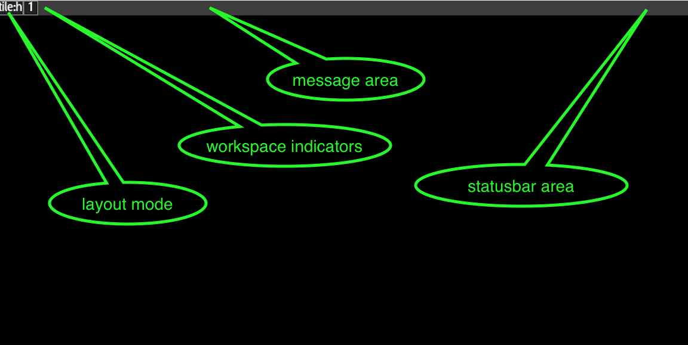

# Statusbar
The statusbar is the dedicated drawing region at the very top or at the
very bottom of the screen. Up and running, it may look something like:

You can see it is divided into three distinct regions:
workspace-control (left), system message (middle-fill), user-control (right).

The workspace control is updated automatically as you switch workspaces,
as workspaces gets tagged or if a window on a workspace alerts for attention.
Each display gets its own statusbar.

# Layout button
The first button indicates the current layouting mode for the active workspace,
and if you click it while not in float, the workspace mode is switched to float.

If you click it while in float mode, it pops up the main menu, and if you right
click it, it will pop up the target window if there is a selected window
around. This is a safety feature to give you a recovery path should the
keyboard break.

# System Message Area
The system message area consumes the 'fill slot' and will be cropped to
whatever space is left after the layout and user area has been drawn. It is
used for system notifications, like if an input device is added or list.

You can also send custom messages to it through the hidden (=bind only) menu
path <i>global/system/status_msg</i>. This is intended for timers and for
external [IPC](ipc).

# User Control Area
Lastly, there is a user control area that you can control through the external
[IPC](ipc). The protocol is similar to that of lemon bar and you should be able
to connect, for instance, i3-status using that protocol. The protocol is as
follows:

- newline separates updates
- %% escapes %
- %{fmtcmd} changes the active format (the bar remembers this)
- \| is used as a group separator
- normal text is just added as it comes (UTF-8)

The fmtcmd values are as follows:
- F#rrggbb sets text color
- B#rrggbb sets group background color
- F- reset to default text color
- S+ switch to next-screen statusbar
- S- switch to previous-screen statusbar
- Sf switch to first (primary) screen
- Sl switch to last screen
- Snum switch to num- screen
- Aidentifier

The Aidentifier is special and turns the group into a button.
If the identifier is a valid menu path, like #path/to/cmd or !path/to/cmd,
that path will be executed if the button is clicked.

Otherwise, the identifier will be written to the output [IPC](ipc) pipe so
that you can hook it up to other programs.

# Future Changes
- Allow replacement with an external client
- Hover on workspace button to see preview of workspace contents
- History function to the message area
- Allow statusbar to be moved to the menu- screen
