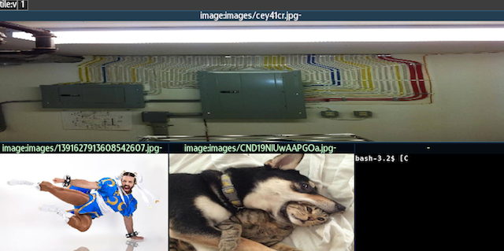

[Resizing](#resizing) [Swapping, Merge, Collapse](#mergecoll) [Tabbed](#tabbed)
[Layouter](#layouter)

# Tiling Window Management

Tiling window management is the default workspace layout management scheme
because of its efficiency in terms of screen utilization and inherently
keyboard friendly nature. The main principle is that client windows should
occupy the maxium amount of screen space. When a new window appears, the
area the currently selected window is occupying gets split up and shared
between the two based on a weight (covered in <i>Resizing</i>, below) and
an insertion mode.

The insertion mode can either be <i>horizontal</i> where a new window becomes
a sibling of the currently selected window, splitting into a new column- or
<i>vertical</i> where a new window becomes an immediate child of the currently
selected window.

The following three screenshots shows a window hiearchy with the new window
(the dog/cat picture) being inserted in horizontal mode versus vertical mode.

The insertion mode can be switched via the <i>global/workspace/layout/tile-horiz
and tile-vert</i> menu paths respectively.

# Resizing <a name="resizing"/>
When you grow or shrink a tile in tiled layout mode, the window size is not
directly affected, but rather its "weight". Initially, each new window is
assigned the same horizontal and vertical weight (of 1.0 multiplied by the
alloted size). This means that when more clients compete for the same space,
the calculated assigned region is biased in favor of- or against- a window
based on its assigned weight.

# Swapping, Merge, Collapse <a name="mergecoll"/>
With the hierarchy that grows from a tiled layout, we need additional control
opterations that are not needed in other layoting modes. Those are <i>swap</i>,
<i>merge</i> and <i>split</i>.

With <i>swap</i> a single window has its position swapped with another in the
desired direction (up, down, left, right). Any children or sibling gets
reassigned so that they stay in the same position.

The following screenshot shows a window hierarchy before and after a swap-left
operation:

With <i>merge</i> any siblings to the right of selected window are forced to
become children of the window instead. The following screenshot shows a
window hierarchy before and after a merge operation:

With <i>split</i> any children of the selected window are promoted to become
siblings. The following screenshot shows a window hierarchy before and after a
merge operation:

# Tabbed Modes <a name="tabbed"/>
Some window managers treat tabbed modes as a sub-management mode of one tile,
though here, we opt for treating an entire workspace as tabbed or not. Instead,
there are explicit work-space modes for having all windows act as 'tabs' in
a vertical or horizontal layout. These modes can be activated through the
<i>global/workspace/layout/tabbed and tabbed-vertical</i>.

# Layouter <a name="layouter"/>
There is a built-in that can extend the tiling layout mode to automatically
manage the insertion and parent/sibbling assignment automatic. This tool can
be found in the <i>global/tools/auto layouting/</i> and is described furthere
in [Autolayout](autolay).

# Future Changes
- Allow tabbed- tiles based on connection hierarchy
- Additional auto-layouting modes (spiral etc.)
