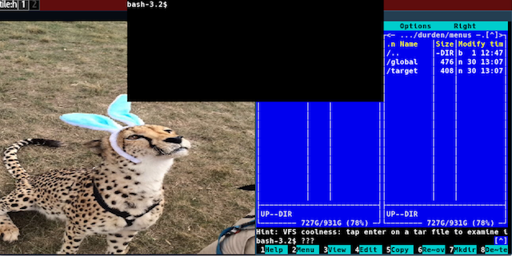
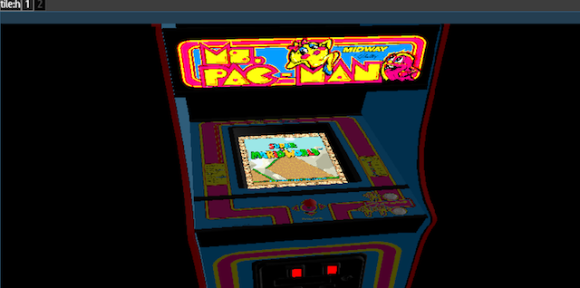

The <i>durden/tools</i> source folder is scanned for scripts on startup.
Anything in this folder can be removed safely without loss of any critical
functions, and are provided as a means for extending durden features in a way
similar to [Widgets](widgets), but with a more generic focus as they can
introduce both visible and non-visibile behavior and are not confined to the
Menu HUD.

The included tools are:
[Model Viewer](#model), [Dropdown Terminal](#dropdown)
[Autolayouter](autolay), [Advanced Float](#advfloat), [Overview](#overview),
[Flair](#flair) and the [Overlay](#overlay).

# Dropdown Terminal <a name="dropdown"/>

The dropdown terminal is both a convenience- terminal that can be reached
regardless of workspace layout mode (though be careful with the dedicated
fullscreen mode as it can spawn, but won't be visible).

It is also a [safety/security](security) and deliberately avoids sharing
settings with the normal [terminal](terminal). It also introduces these
additional settings:

- Width: percentage of active display width to allocate
- Height: percentage of active display height to allocate

Its settings are registered on the path
<i>global/settings/tools/dropdown terminal</i> and the terminal itself is
activated via the <i>global/tools/dropdown terminal</i> path. To be efficient,
it should be bound to a keyboard combination.

Also make sure that the lock toggle setting (<i>input/keyboard/lock toggle</i>)
is set to meta1 or meta2 as the 'double tap to unlock' feature is used to hide
the terminal - or the terminal will refuse to activate.

# Model Viewer <a name="model"/>
This was added more for the 'demo' effect rather than much serious effort, and
relies on an old and ugly model format, scanned in the <i>durden/models</i>
directory. The README file in that directory also tells where you can download
some example modules.

The tool adds a <i>global/tools/modelviewer</i> path for browsing/launching
models. It also adds the target window paths <i>target/source</i> and
<i>target/view</i>.

Clicking/dragging with the mouse in a model window either moves the camera
or rotates the model (TAB symbol switches between these two states).

The <i>target/source</i> path specifices which window that other input events
will be forwarded to, and what data source should be added to the display-
portion of a model.

The <i>target/view</i> switches between two predefined viewing positions/angles.

# Overlay <a name="overlay"/>

This tool goes well with the window slicing effect from
<i>target/window/slice</i> and is used getting miniature overviews of the
contents of a specific window.

It is activated via the <i>target/window/overlay</i> path and creates an aspect
scaled version that is bound to either the top-left or top-right corner of
the display that is currently active. These will persist even in normal
fullscreen and when switching workspaces. You can add as many as will fit in
the column of your display.

You can find its actions at <i>global/tools/overlay</i> where you have access
to a toggle visible on/off action, the option to delete individual slots and
the option to migrate the column to another display (if there are multiple
displays available).

You can configure the appearance of the column through the
<i>global/settings/overlay</i> submenu where you have controls for the relative
maximum size, opacity, active corner and active shader.

# Advanced Float <a name="advfloat"/>
The float capabilities of the normal layout mode only cover the bare necessities:
drag-resize, drag-move, toggle maximize and so on. The advanced float tool extends
these capabilities with:

## Spawn Control
From the <i>global/settings/wspaces/float/spawn_action</i> path it is possible
to change how window spawns are treated when a workspace in float mode is
active. The default is that the window manager simply picks a place, typically
based on a known mouse cursor position or the most fitting continuous region of
non-occluded space exists.

If the method is set to <i>click</i> the cursor will get a preview window of the new
window attached, and the window will be spawned at the current mouse cursor position
when a mouse click is registered or if there occurs another window spawn before that
has happened.

If the method is set to <i>draw</i> the cursor will switch into region select mode,
and both the cursor and the marked region will be use to position and size-suggest
the new window.

## Cursor Actions
This feature uses a custom configuration file that is scanned on startup. It
resides in <i>durden/tools/advfloat/cactions.lua</i>. It provides the option to
define regions that gets activated related to mouse state (enter, leave, drag -
and so on). It can be used to define features e.g. drag/drop a window over a

## Hide Targets
This feature adds a <i>target/hide</i> path and a corresponding
<i>settings/wspaces/float/hide_target</i> option, which allows a window to be
hidden into some re-activatable shape, like a button on the statusbar.

# Overview <a name="overview"/>
This tool is activated via a subpath of <i>global/tools/ws_overview</i> and, if
there are more than one populated workspace on the current display, switches
the display into the HUD mode and presents some kind of overview navigation.

The look and behavior of the overview navigation depends on which subpath was
taken, and the following ones exists currently:

## Workspace(Tile)
The tile overview simply generates miniature versions of each workspace ordered
from lowest index to highest, centered vertically on the screen. Keybindings
match the directional keys and accept- for switching between workspaces along
with the number keys for immediately activating a specific workspace.

# Flair <a name="flair"/>

The flair tool adds additional visual animations and effects, similar to that
of the 'compiz' window manager. Flair effects are currently subdivided into the
follow categories: hide, destroy, create, minimize, drag, background and display,
all with slightly different characteristics.

To enable, you should configure which effects you want for each slot by going
to the normal <i>global/settings/tools/flair</i>. Some advanced effects also
allow you to tune further, e.g. cloth physics, drag opacity or particle system
intensity.

The hide/destroy/create/minimize and drag effect targets are window- targeted
actions. These can be set on or off via <i>global/tools/flair/window_effects=yes/no</i>.

The background and display effects are activated on a 'per effect' basis via the
<i>global/tools/flair/display</i> and <i>global/tools/flair/background</i> effect,
though many of their behaviors require the display to be in a certain state or for
a background image to be set.

The tool is easily extendable by modifying the scripts in the tools/flair
subfolder.

# Future Changes
- On-screen Keyboard
- Touchpad Configuration
- VR support for model viewer
- Notification Agents
- Composition Surface for sharing/recording
