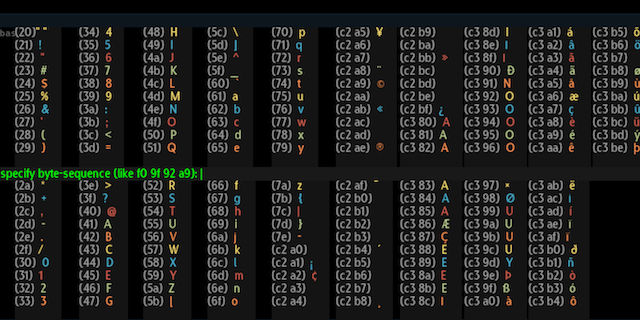
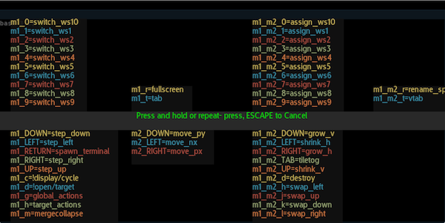
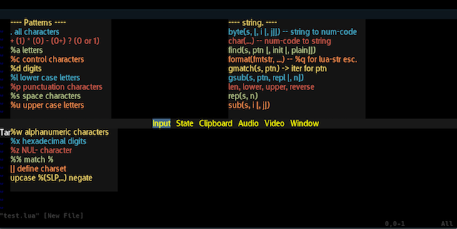

# Widgets

As shown in this screenshot from the section on [the menu](menu), most of
the screen space in the HUD-like menu is reserved for widgets.

Widgets come in two variations: built-in lua scripts and external clients
that identify as widgets. The external client support is currently
experimental and not supported / activated in the main code, so right now,
it is reserved for 'future changes'.

The source path <i>durden/widgets/*.lua</i> is scanned for widgets during
startup. These provide a list of menu paths or trigger functions that will
be evaluated as the menu is navigated. These widgets are intended to show
additional / optional contextual information and controls.

For instance, this widget is activated when interactively mapping a UTF-8
sequence to a keyboard combination:

This widget is shown when interactively creating a new keybinding:

# Cheat Sheet
The cheat-sheet is an example of a target specific widget. It scans a folder
of txt files and checks the current window tag, title or ident for a matching
pattern.

These can be found in the <i>durden/widgets/*.txt</i> path. An example would
be:
        +%.lua
        ---- Patterns ----
        . all characters
        %a letters

        ---- Strings -----
        byte(s, [, i, [, j]]) - string to num code
        char(...) - num code to string

The first line is the matching pattern, groups are separated with an empty
line. Colors are chosen by stepping through the palette defined in
<i>durden/gconf.lua</i> this screenshot shows a version of the example above:

# Future Changes
- External clients with "WIDGET" primary segid
- Widget for analog input filter tuning
- Widget for color picking
- Extend cheatsheet widget with image support
